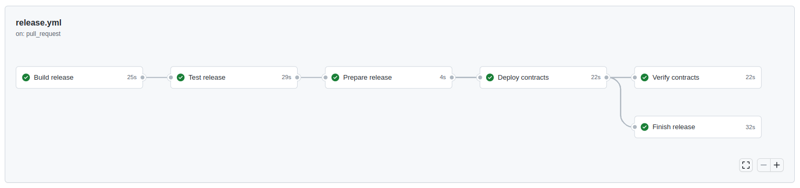
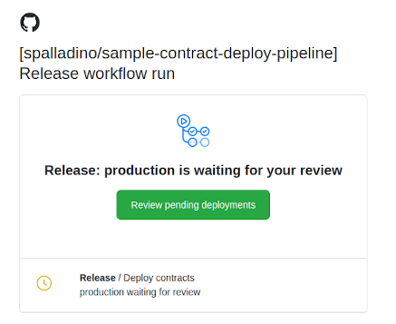
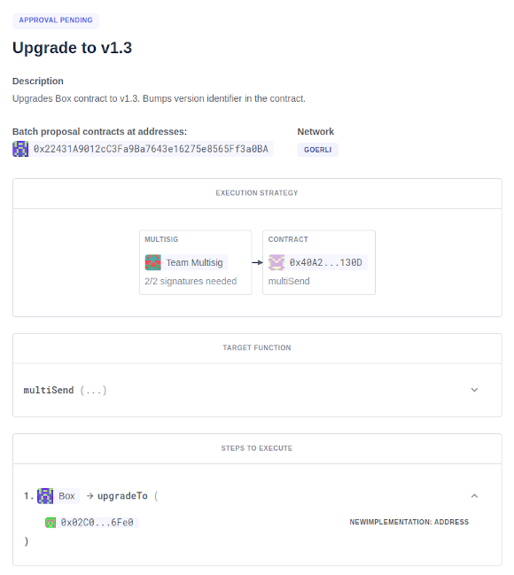
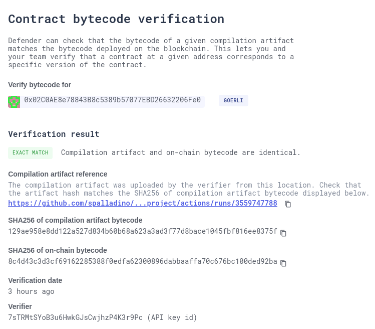

# Sample contract deployment pipeline

This is a proof of concept for a smart contract deployment pipeline using Github Actions. The pipeline is composed a set of build, test, deployment, verification, and post-deploy configurable Hardhat scripts.



## Example

The following release spec in a pull request from branch `release/1.3` will compile all contracts, run tests, compare the source deployed versus the audited one, deploy a new implementation for the `Box` contract, verify its source code and binary, and create a new proposal for upgrading it. The workflow optionally pauses before sending the deployment transactions and creating the proposal and requires a manual review before proceeding.

```yaml
title: Upgrade to v1.3
network: goerli
deploy: prepare-upgrade Box
verify: verify-deployed
finish: propose-upgrade
audited: f37fb0c75b4ec2c13e063d257499e7dcc643e468
description: |
  Upgrades Box contract to v1.3.
  Bumps version identifier in the contract.
```

### Autogenerated summary

The deployment workflow autogenerates a [summary](https://github.com/spalladino/sample-contract-deploy-pipeline/actions/runs/3559747788) with deployment info and relevant links. It will also alert if there is a diff in the contracts between the audited commit and the deployed one.

> #### Upgrade to v1.3
> 
> **Network:** goerli
>
> **Commit:** [`8aa72d2b03db9015dcb74f65515840677e23357a`](https://github.com/spalladino/test-hardhat-project/tree/8aa72d2b03db9015dcb74f65515840677e23357a)
> 
> Upgrades Box contract to v1.3. Bumps version identifier in the contract.
> 
> #### Audit
> 
> Audited contracts at commit [`f37fb0c7`](https://github.com/spalladino/test-hardhat-project/tree/f37fb0c75b4ec2c13e063d257499e7dcc643e468).
> Contracts have been modified since audit :warning:
> 
> ```diff
> diff --git a/contracts/Box.sol b/contracts/Box.sol
> index 1fa3762..bfedd5d 100644
> --- a/contracts/Box.sol
> +++ b/contracts/Box.sol
> @@ -25,7 +25,7 @@ contract Box is Initializable, OwnableUpgradeable, UUPSUpgradeable {
>      }
>  
>      function version() external pure returns (string memory) {
> -      return "v3";
> +      return "v1.3.7";
>      }
>  
>      function _authorizeUpgrade(address newImplementation)
> ```
> 
> #### Implementation contracts deployed
> 
> - Box at [`0x02C0AE8e78843B8c5389b57077EBD26632206Fe0`](https://goerli.etherscan.io/address/0x02C0AE8e78843B8c5389b57077EBD26632206Fe0)

### Manual review

To prevent accidental expensive deployments, the workflow pauses and requires a manual review from a set of designated team members before proceeding. The same happens before creating the upgrade proposal, so the development team can review the deployment before passing responsibility to signers.



### Upgrade proposal

The upgrade proposal is created in OpenZeppelin Defender:



And includes bytecode verification to close the loop with the deployed artifact:



## How to use

To trigger a new release, create a new folder with the version identifier `vX.Y(.Z)` in the `releases` folder, with an `index.yml` file with the spec of the release. This includes:

- `title`: Title of the release
- `description`: Description of what this release is about
- `network`: The network where to deploy, needs to be defined in the hardhat config file
- `audited`: Optional commit in which the code was audited, used to show the diff with the deployed version
- `deploy`: Deployment command to execute
- `verify`: Verification command to execute
- `finish`: Wrap-up command to execute

All commands are passed to `yarn hardhat`, so any hardhat task can be used. For simplicity, some tasks are already defined:

- `deploy-proxy CONTRACT ARG1 ARG2...`: Deploys a contract as upgradeable and initializes it with ARGs
- `prepare-upgrade CONTRACT1 CONTRACT2`: Deploys new implementations for all CONTRACTs
- `verify-deployed`: Reads deployed contracts and verifies [source code in Etherscan](https://etherscan.io/verifyContract) and [artifacts in Defender](https://docs.openzeppelin.com/defender/admin#bytecode-verification)
- `propose-upgrade`: Creates a [batch proposal](https://docs.openzeppelin.com/defender/admin#batches) to simultaneously upgrade all contracts via a multisig in Defender

Alternatively, custom scripts can be used by passing them through hardhat's `run` command. This allows for more complex deployment scripts to be run. See [v1.4/deploy.ts](releases/v1.4/deploy.ts) for an example.

Once the release is defined, create a pull request from the `release/X.Y(.Z)` branch into master. This will trigger the [release](.github/workflows/release.yml) workflow, that includes the build, test, deployment, verification, and post-deploy jobs.

## How it works

The release workflow is triggered by pull requests from `release/` branches, and runs on the release branch, not on the merge commit. Each stage in the workflow is set up as a sequential job, which can be mapped to common hardhat tasks or custom scripts.

### Build

An initial build job compiles contracts and saves them as artifacts for the following jobs. No other job recompiles contracts, to ensure the same bytecode is preserved throughout the workflow.

### Test

Unit tests are run on the contracts to be released, using `hardhat test`. Other contract test runners could be used as well.

### Prepare

A preparation step parses release info from the user-defined yaml, and outputs an initial release summary. Any diffs with the audited commit are shown here, so the deployment can be halted if needed.

### Deploy

The deployment job requires manual approval to run (see _environments_ below), and uses the defined `PRIVATE_KEY` to deploy contracts. Rationale for using a low-security private key is that the deployer account should not have any privileges in the system, and the only risk of leaking it is losing the funds for paying deployment fees. Still, a managed solution such as a [Defender Relay](https://docs.openzeppelin.com/defender/relay) could be used instead.

In this example, the [Hardhat Upgrades](https://docs.openzeppelin.com/upgrades-plugins/1.x/) plugin is used for deploying contracts, but other deployment solutions could be used as well. 

The deployment script should output the deployed contracts to a `deployed.json` file in the release folder, and update a global `addresses.json` registry. The provided `deploy-proxy` and `prepare-upgrade` tasks both do this. Once finished, it commits those changes into the release branch, so once merged, the latest deployment info is kept on the main branch.

### Verify

The verification step is meant to verify source code and artifacts. The provided `verify-deployed` task will read newly deployed contracts out of the `deployed.json` file, and verify source on Etherscan and bytecode on Defender. Note that this job can fail, yet the post-deploy step runs anyway. Verification is separate from deployment so it can be re-run if needed.

### Post-deploy

The post-deploy job is intended to cover any actions that are meant to be run after the deployment. It requires manual approval as well, so a reviewer can check if the deployment went according to plan before triggering it.

The main use case for this step is the `propose-upgrade` task, which creates a new batch multisig proposal to upgrade all contracts for which a new implementation was deployed.

## Setup

To set up a similar flow in another repository, besides the workflow file and hardhat tasks, secrets and environments need to be configured.

### Secrets

The workflow requires a few secrets to be set in order to run, such as:

- `INFURA_PROJECT_ID`
- `ETHERSCAN_API_KEY`
- `DEFENDER_API_KEY`
- `DEFENDER_API_SECRET`
- `PRIVATE_KEY`

### Environments

Critical steps, namely deployment and post-deploy, **require manual approval** before running. This gives the reviewer a chance to check everything is in place before actually deploying contracts, and to go through the deployment before requesting the multisig signers to approve. This is implemented by defining a Github environment that requires manual approval.

## License

All code in this repository is released under the [MIT License](LICENSE).

